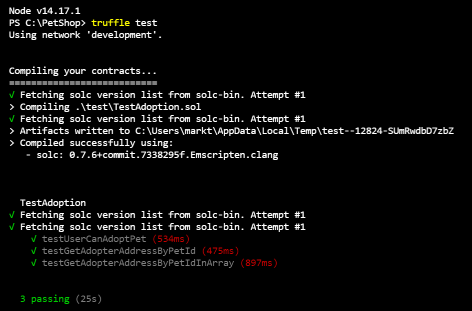
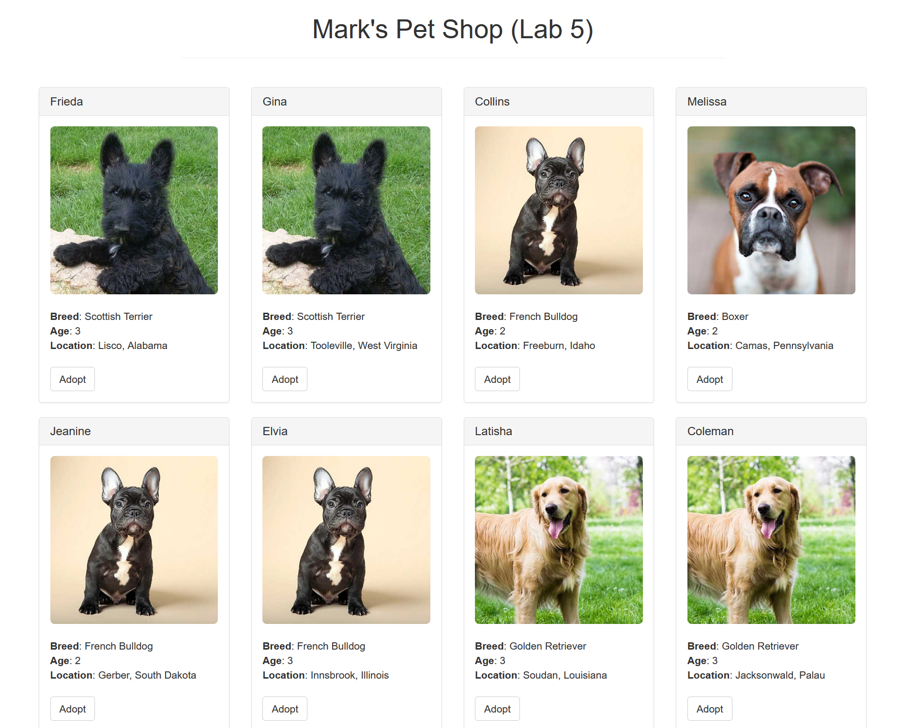

# `Mark's Pet Shop (Lab 5)`

At the terminal, type the following to download the pet shop boilerplate

## `truffle unbox pet-shop`

Run Ganache and then the following commands:

### truffle test

### truffle migrate

If everything is in order, run the app:

### `npm run dev`

View app on the [localhost:3000](http://localhost:3000)

